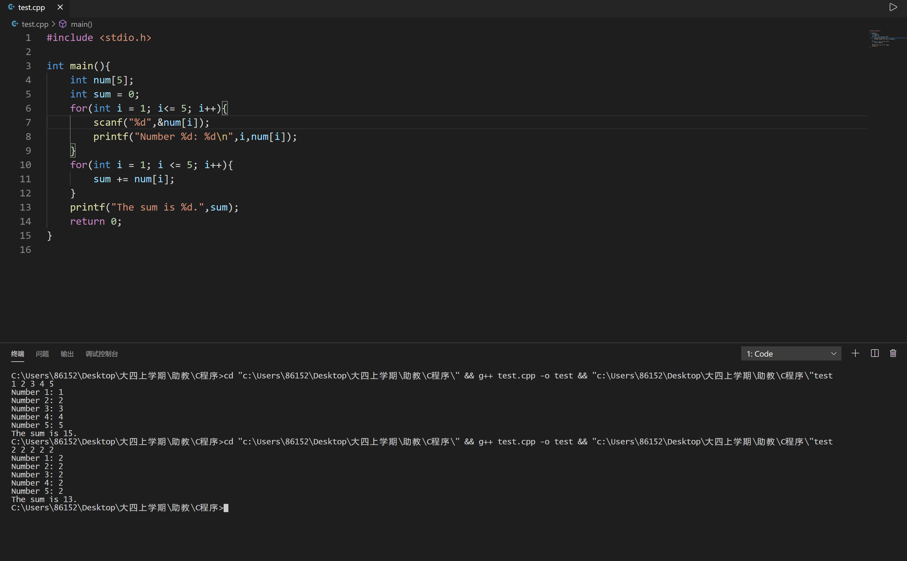
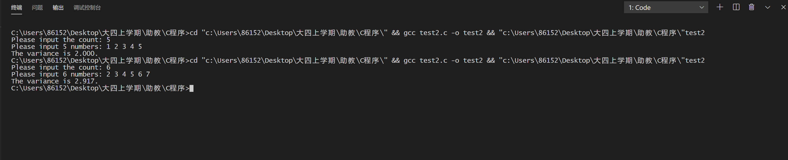

# lab7

>本节目标：
>
>1. 巩固循环语句与控制语句。
>2. 学习数组的使用。
>3. PJ拆解。
          
获取及提交lab
-------
获取：通过 https://github.com/C-FUDAN-2020/lab7 获取。

提交物：将你完成思考题的文档，编程题的代码作为 lab7 的提交物。

提交：将提交物命名为学号_姓名 （如20302010000_王明），提交至超星学习通对应的作业题目中。

截止时间：北京时间 2020年11月08日 23:59:59

## 一维数组知识（可跳过）

#### 1. 一维数组的定义

定义一维数组的一般形式为`类型说明符 标识符[常量表达式]`。在当前流行的C++系统中，定义数组不再要求`常量表达式`，只需要具有确定整数值的表达式。下面几个例子都是合法定义的数组：
```c
int score[40];
```
```c
int number = 10;
char s[number];
```
```c
#define NUMBER_COUNT 20
float numbers[NUMBER_COUNT];
```
#### 2. 一维数组的初始化
一维数组的初始化可以选择在定义时进行：
```c
// 初始化所有元素
int d[5] = {0,1,2,3,4}; 

// 初始化前3个元素
int e[5] = {0,1,2}; 

//定义时初始化，且不指定数组长度，默认数组长度为集合的长度。即数组a的长度是3
int a[] = {0,1,2};
```

此外，一维数组的初始化也可以单独对每个元素赋值：
```c
int d[5];
// 第一个元素初始化为4
d[0] = 4; 

// 结合循环初始化所有元素
for(int i = 0; i < 5; i++){
  d[i] = i + 1;
}
```

#### 3. 一维数组的访问
数组是一片连续的内存空间，数组的元素紧密存储。**牢记数组元素的下标从0开始，直至数组元素个数减1**。

#### 4. 使用举例-从命令行中读入数组长度和数组元素的值

```c
#include <stdio.h>
int main(){
    int count;
    printf("Please input the count: ");
    // 读入数组的长度
    scanf("%d",&count);
    printf("Please input %d numbers: ",count);
    int nums[count];
    // 通过循环读入为数组元素赋值，切记使用scanf需要通过&取地址
    for(int i = 0; i < count; i++){
        scanf("%d",&nums[i]);
    }
    return 0;
}
```


## 思考题目

> 请提交书面答案的文档

### 结构化编程
思考如下所示的代码会有怎样的控制台输出，并解释原因。

```c
#include <stdio.h>
int main(){
    int k=4;
    for(int i = 0; i < 3; i++){
        switch(k){
            default:
                k--;
                printf("It ");
            case 1:
                printf("is ");
                break;
            case 2:
                k++;
                printf("%d",2*k);
            case 3:
                k = k - i;
                printf("%d",3*(k<3?2:k));
                break;
            case 9:
                printf("%d",9*k);
                break;
        }
    }
    return 0;
}
```

### 数组访问
小明同学通过如下所示的代码来对若干数据进行求和。但是小明测试时输入5个数据`2 2 2 2 2`，得到的求和结果却是13，这显然不是正确的结果；接着小明又发现如果输入的5个数据中最后一个数据是5，得到的求和结果就不会出现错误。测试结果如图所示。请帮他分析产生这个现象的原因。

```c
#include <stdio.h>

int main(){
	int num[5];
	int sum = 0;
	for(int i = 1; i<= 5; i++){
	        // Here we store the input integer at nums[i].
		scanf("%d",&num[i]); 
		printf("Number %d: %d\n",i,num[i]);
	}
	for(int i = 1; i <= 5; i++){
		sum += num[i];
	}
	printf("The sum is %d.",sum);
	return 0;
}
```
<div style="align: center">
    
</div>

## 编程题

### 计算实数数据的方差

编写一个C程序，计算若干`实数`的方差。效果如下图。

输入：实数的个数和若干实数

输出：若干实数数据的方差

限制：
> 1. 实数的个数满足 0<count<100。
> 2. 输入的实数可以通过单精度类型变量存储。
> 3. 输出的方差保留3位小数。
> 4. 不考虑其他非法输入。

<div style="align: center">
    
</div>

### PJ地图输出（初步）
